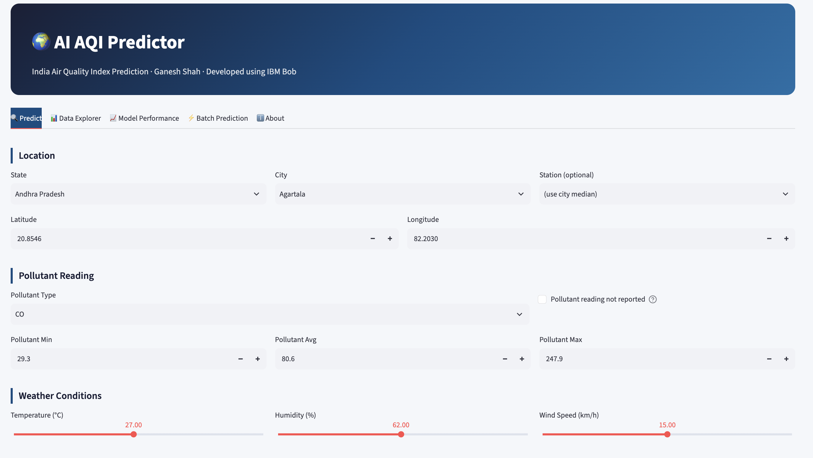
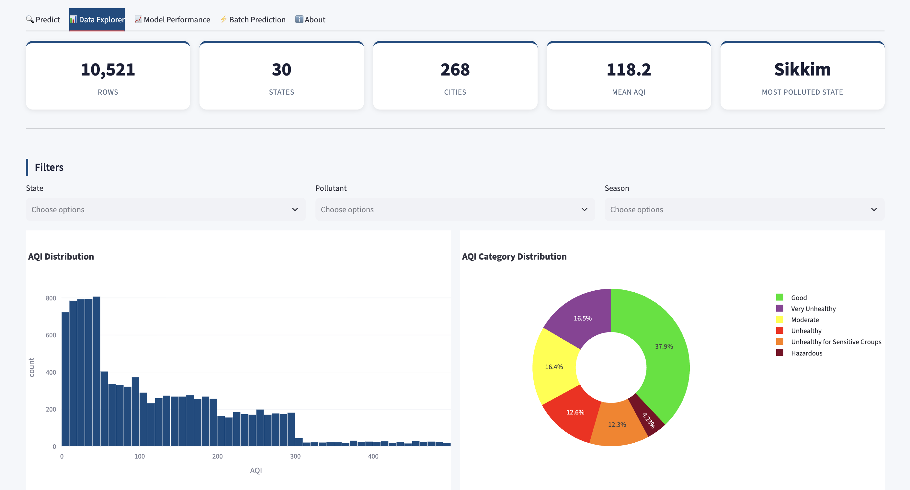
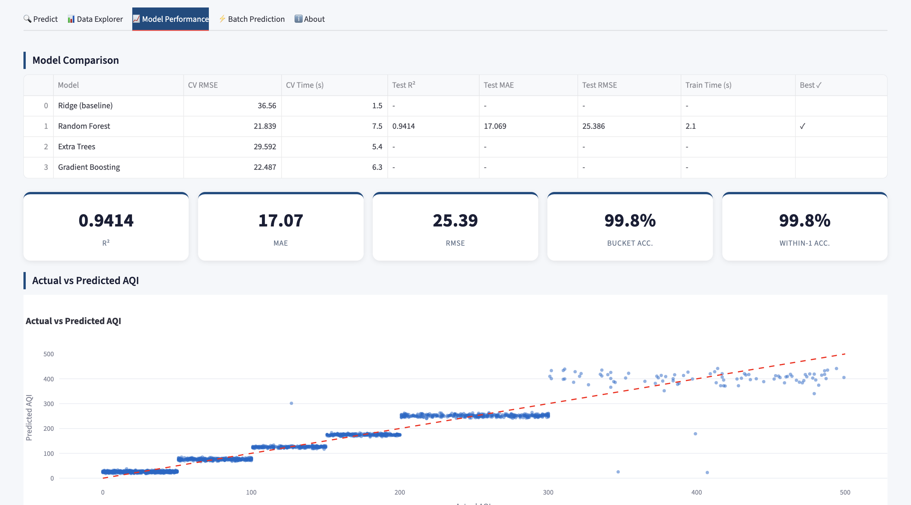

# 🌍 AI AQI Predictor


---

## Overview

**AI AQI Predictor** is a production-quality, fully offline Streamlit application that predicts the
Air Quality Index (AQI) for Indian monitoring stations. It uses a **Random Forest Regressor** wrapped
in a scikit-learn `ColumnTransformer + Pipeline` to predict AQI from pollutant readings, weather
conditions, location, and time features. The app includes a live prediction UI with cascading
location selectors, a data explorer with an interactive India map, a full model-performance
dashboard, batch prediction, and a detailed about/methodology page. Every number displayed in the
app is computed live from the data — nothing is hard-coded.

---

## Key Features

- 🔍 **Single Prediction** — cascading State → City → Station selector, auto-filled lat/lon, AQI
  gauge with coloured bands, likely range, health advisory, and session history download.
- 📊 **Data Explorer** — KPI cards, AQI histogram, category donut, top/bottom 10 states, seasonal
  and pollutant breakdowns, monthly trend, correlation heatmap, and an OpenStreetMap station map.
- 📈 **Model Performance** — model comparison table, actual vs predicted scatter, residual
  histogram, permutation feature importance, confusion matrix, and per-class classification report.
- ⚡ **Batch Prediction** — upload a CSV, validate inputs, predict all rows, download results.
- ℹ️ **About** — full methodology, data-trap explanations, limitations, and disclaimer.
- 🏗️ **Single-file architecture** — one `.py` file; no external assets; fully offline.

---

## Screenshots

> *(Insert screenshots after running the app)*
>
> <!--  -->
> <!--  -->
> <!--  -->

---

## Dataset Description

| Column | Meaning | Type |
|--------|---------|------|
| `country` | Always "India" (constant) | str |
| `state` | Indian state (30 unique) | str |
| `city` | City name (268 unique) | str |
| `station` | Monitoring station (503 unique) | str |
| `last_update` | Timestamp of reading (2025–2027, includes augmented dates) | str |
| `latitude` | Station latitude | float |
| `longitude` | Station longitude | float |
| `pollutant_id` | Pollutant measured: PM2.5, PM10, NO2, SO2, CO, OZONE, NH3 | str |
| `pollutant_min` | Minimum pollutant concentration (µg/m³ or ppb) | float |
| `pollutant_max` | Maximum pollutant concentration | float |
| `pollutant_avg` | Average pollutant concentration (dominant model feature) | float |
| `AQI` | **Target**: Air Quality Index, integer 0–499 | int |
| `AQI_Bucket` | AQI category label (US-EPA breakpoints) — **NOT a feature** | str |
| `Temperature_C` | Ambient temperature in °C (15–40 °C) | float |
| `Humidity_%` | Relative humidity % (30–95 %) | float |
| `Wind_Speed_kmh` | Wind speed in km/h (0–30 km/h) | float |
| `Year` | Year (2025–2027); dropped from model (augmented dataset) | int |
| `Month` | Month 1–12; cyclically encoded as sin/cos | int |
| `Day` | Day of month; dropped (collinear with timestamp) | int |
| `Hour` | Hour 0–23; cyclically encoded as sin/cos | int |
| `Day_of_Week` | 0=Monday … 6=Sunday | int |
| `Season` | Winter / Spring / Summer / Autumn | str |

**Size:** 10,521 rows × 22 columns · No duplicate rows · 357 rows have missing pollutant readings
(all are Hazardous AQI 301–499).

---

## Methodology

### Preprocessing
1. Drop `country` (constant), `station` (503 unique), `city` (268 unique), `last_update`, `Year`, `Day`.
2. Add `pollutant_missing` binary flag (1 if `pollutant_avg` is NaN) **before** imputation.
3. Add `pollutant_range = pollutant_max − pollutant_min`.
4. Cyclically encode `Month` → (`Month_sin`, `Month_cos`) and `Hour` → (`Hour_sin`, `Hour_cos`).
5. Median `SimpleImputer` inside the pipeline for numeric columns (prevents test-set leakage).
6. `StandardScaler` for numeric columns; `OneHotEncoder(handle_unknown="ignore")` for categoricals.

### Feature Engineering
| Derived Feature | Formula |
|----------------|---------|
| `pollutant_range` | `pollutant_max − pollutant_min` |
| `pollutant_missing` | 1 if `pollutant_avg` is NaN, else 0 |
| `Month_sin` / `Month_cos` | `sin(2π·Month/12)`, `cos(2π·Month/12)` |
| `Hour_sin` / `Hour_cos` | `sin(2π·Hour/24)`, `cos(2π·Hour/24)` |

### Models Compared

| Model | CV RMSE |
|-------|---------|
| Ridge (baseline) | 36.560 |
| **Random Forest ✓** | **21.839** |
| Extra Trees | 29.592 |
| Gradient Boosting | 22.445 |

5-fold cross-validation on the training set; best model selected by CV RMSE.

### Evaluation Strategy
- **80/20 stratified split** by `AQI_Bucket`, `random_state=42`.
- No time-based split (dataset includes future augmented dates; 3,523 rows share 2026-07-01 23:00).
- Prediction interval: 10th–90th percentile of hold-out residuals.
- Feature importance: permutation importance on 500-row hold-out sample.

---

## Results

| Metric | Value |
|--------|-------|
| **Best Model** | Random Forest Regressor |
| **Test R²** | **0.9414** |
| **Test MAE** | **17.069 AQI pts** |
| **Test RMSE** | **25.386 AQI pts** |
| **Bucket Accuracy** | **99.81%** |
| **Within-1 Accuracy** | **99.81%** |

### Per-Category Results

| Category | Precision | Recall | F1-Score | Support |
|----------|-----------|--------|----------|---------|
| Good | 0.998 | 1.000 | 0.999 | 798 |
| Moderate | 1.000 | 1.000 | 1.000 | 345 |
| Unhealthy for Sensitive Groups | 1.000 | 0.996 | 0.998 | 259 |
| Unhealthy | 0.996 | 1.000 | 0.998 | 265 |
| Very Unhealthy | 1.000 | 1.000 | 1.000 | 349 |
| Hazardous | 0.989 | 0.966 | 0.977 | 89 |

---

## Honest Findings

### Weather is Near-Noise
Temperature, Humidity, and Wind Speed each have **|r| < 0.02** with AQI:

| Feature | Pearson r with AQI |
|---------|-------------------|
| `pollutant_avg` | **+0.919** |
| `pollutant_min` | +0.660 |
| `pollutant_max` | +0.586 |
| `Temperature_C` | +0.004 |
| `Humidity_%` | −0.014 |
| `Wind_Speed_kmh` | −0.021 |

Weather inputs are retained for completeness but contribute negligible model improvement.

### Missing Pollutant Values Map to Hazardous
All 357 rows (3.4%) with missing pollutant readings are in the **Hazardous** bucket (AQI 301–499).
The `pollutant_missing` binary flag captures this signal. The "Pollutant reading not reported"
checkbox in the Predict tab correctly pushes predictions into the Hazardous range.

### No Time-Based Split
The dataset spans 2025–2027 and 3,523 rows share an identical timestamp (2026-07-01 23:00:00),
indicating that the data is enriched/augmented rather than a pure real-time operational feed.
A stratified random split is used. `Year`, `Day`, and `last_update` are excluded from model features.

---

## Installation

### Prerequisites
- Python 3.9+ (tested on 3.9 and 3.14)
- The dataset file: `enriched_aqi_dataset.csv` (place it next to the script)

### macOS / Linux

```bash
# 1. Clone or download the project
git clone <repo-url> AQI_Predictor
cd AQI_Predictor

# 2. Create a virtual environment
python3 -m venv venv
source venv/bin/activate

# 3. Install dependencies
pip install -r requirements.txt

# 4. Place the dataset next to the script (if not already there)
# cp /path/to/enriched_aqi_dataset.csv .

# 5. Run the app
streamlit run GaneshShah_AQIPredictor.py
```

### Windows

```cmd
:: 1. Clone or download the project
git clone <repo-url> AQI_Predictor
cd AQI_Predictor

:: 2. Create a virtual environment
python -m venv venv
venv\Scripts\activate

:: 3. Install dependencies
pip install -r requirements.txt

:: 4. Place the dataset next to the script (if not already there)

:: 5. Run the app
streamlit run GaneshShah_AQIPredictor.py
```

The app will open at `http://localhost:8501`.

---

## Usage Guide

### 🔍 Predict Tab
1. Select **State → City → Station** (or leave station as "use city median").
2. Latitude/longitude auto-populate from the dataset.
3. Choose the **Pollutant Type** and enter Min/Avg/Max readings (or tick "not reported").
4. Adjust **Weather** sliders (optional — weather has minimal model impact).
5. Set the **Date & Hour** (season auto-derived).
6. Click **Predict AQI** to see the gauge, likely range, health advisory, and recommended actions.
7. All predictions are logged in the session history table; download as CSV.

### 📊 Data Explorer Tab
- Use the **Filters** (state, pollutant, season) to drill down.
- View distribution charts, state rankings, seasonal trends, correlation heatmap, and the India map.
- Download filtered data as CSV.

### 📈 Model Performance Tab
- See the 4-model CV comparison table and headline test metrics.
- Actual vs Predicted scatter, residual histogram, permutation feature importance, confusion matrix,
  per-class classification report, and plain-English findings.

### ⚡ Batch Prediction Tab
1. Download the **CSV template**.
2. Fill in rows (one per prediction).
3. Upload and click predict.
4. Download results with predicted AQI, category, and likely range.

### ℹ️ About Tab
Full methodology, data-trap explanations, limitations, and disclaimer.

---

## Project Structure

```
AQI_Predictor/
├── GaneshShah_AQIPredictor.py   # Main Streamlit app (single file)
├── enriched_aqi_dataset.csv     # Dataset (not committed to git)
├── requirements.txt             # Dependencies
├── README.md                    # This file
└── GaneshShah_ProjectReport.docx  # Detailed project report
```

---

## Limitations

1. Dataset is enriched/augmented with future dates (2026–2027); not a live operational feed.
2. No time-series forecasting — each row is an independent snapshot.
3. Weather variables have negligible model importance (~|r| < 0.02 with AQI).
4. City and station granularity are dropped from the model (high cardinality).
5. Prediction intervals are empirical (hold-out residual percentiles), not formal Bayesian intervals.
6. AQI breakpoints follow US-EPA methodology; CPCB India uses different sub-index formulas.
7. Model trained on India data only; not applicable to other countries.

---

## Future Work

- Real-time data integration via CPCB API or Open-Meteo.
- Time-series forecasting (LSTM / Prophet) for 24-hour AQI predictions.
- City-level models with more granular spatial features.
- Explainability with SHAP values per prediction.
- Conformal prediction for statistically valid coverage intervals.
- Deployment on Streamlit Cloud / Docker container.

---

## Author

**Ganesh Shah**
*Developed using IBM Bob*

---

## License

MIT License — see [LICENSE](LICENSE) for details.
Free to use for educational and research purposes.

---

## Acknowledgements

- **IBM Bob** — AI development assistant used to architect and build this project.
- **US EPA** — AQI breakpoints and methodology.
- **CPCB India** — National Air Quality Index framework (India, 2014).
- **scikit-learn** — Machine learning pipeline and models.
- **Streamlit** — Web application framework.
- **Plotly** — Interactive visualizations.
- Dataset enriched from publicly available CPCB monitoring station data.
